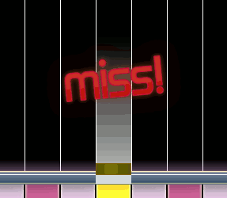

# Skinning Tutorial (osu!mania)

## skin.ini

Since skin version 2.4, the osu!mania mode has been more and more customizable/skinable.
Because of this, enabling skin versions 2.3 and below will not enable some features!
Notably, skin versions 2.4+ has improved scaling and new commands for the skin.ini file.

## Lighting

osu!mania has a separate lighting image than osu!standard and osu!catch does.
While osu!standard and osu!catch uses a circular one for its hitobjects, osu!mania can use any shape to overlay the keys when they are being pressed against a note.
`LightingN` and `LightingL` are animatable images that appear when you hit a note on judgment bar.
Do note that this can animated, though this is a pretty fast animation.

`LightingN` appears after a **note** is hit. Whereas, `LightingL` appears after the hold note is pressed.

<!-- TODO images -->

## Hitbursts

`mania-hit0`, `mania-hit50`, `mania-hit100`, `mania-hit200`, `mania-hit300`, `mania-hit300g` are the hitbursts for osu!mania.
These are animatable when playing ingame, but their animations plays very quickly and is *not* looped, so try to be clever to make them visible.

When the player is viewing the ranking screen, do note that osu! will not animate the animations, if given.
Instead, osu! will take the first frame and display that on the scoreboard.

_Default skin_

<!-- TODO image examples -->

## Keys

`mania-key1`, `mania-key2`, and `mania-keyS` are the keys/buttons.
Be careful when using patterns.
Because later in .ini files you might set length of buttons that can make patterns stretched.
The special button (`mania-keyS`) is used in 7k/8k game mod.

`mania-key1D`, `mania-key2D`, and `mania-keySD` are the same as above, but appears when pressed down.

<!-- TODO images -->

## Notes

mania-note1/2/S - Skin for mania notes.
mania-note1H/2H/SH - Skin for head parts of "slider".
mania-note1L/2L/SL - Skin for body (technically called the Length) part of "slider". This one can be animated.
mania-note1T/2T/ST - Skin for end parts of "slider".

<!-- TODO images -->

## Stage

The osu!mania game mode is composed of a stage.
The stage has several parts in it, listed below.

### Hint

mania-stage-hint - known as judgment bar.
Place where you need to hit note correctly.
If you have problems with correct position of it use judgment line that you can set in .ini files.

<!-- TODO images -->

### Left and Right

mania-stage-left/right - A left/right part of mania playfield.
They aren’t restricted by size, so you can make neat sides by adding something more than border.
If you will use it just for border, do a smaller part - rest will be repeated from upper part of screen to bottom.

But if you are going to something larger, set height at 768px and width of your preference.

<!-- TODO images -->

### Light

mania-stage-light - special light that appears on column stage when you hit a button. Game will always try to fit it into column width, making them wide will force game to resize it to size of column.

<!-- TODO images -->

## Mod icons

The osu!mania mode has a few mods of its own.

<!-- TODO images -->

### xKey

The key mods changes the number of keys you play up to.
However, this does *not* affect osu!mania maps.

<!-- TODO images -->

### CO-OP

The CO-OP mod splits the stage in two, doubling the number of keys for osu!standard maps.
This does work for osu!mania maps, but will only split the stage in two, distributing the keys evenly on both sides.

<!-- TODO images -->

### Random

The random mod will randomly mix the columns around, making maps harder (or easier).

<!-- TODO images -->
